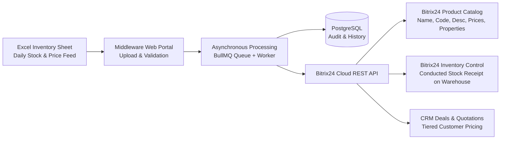
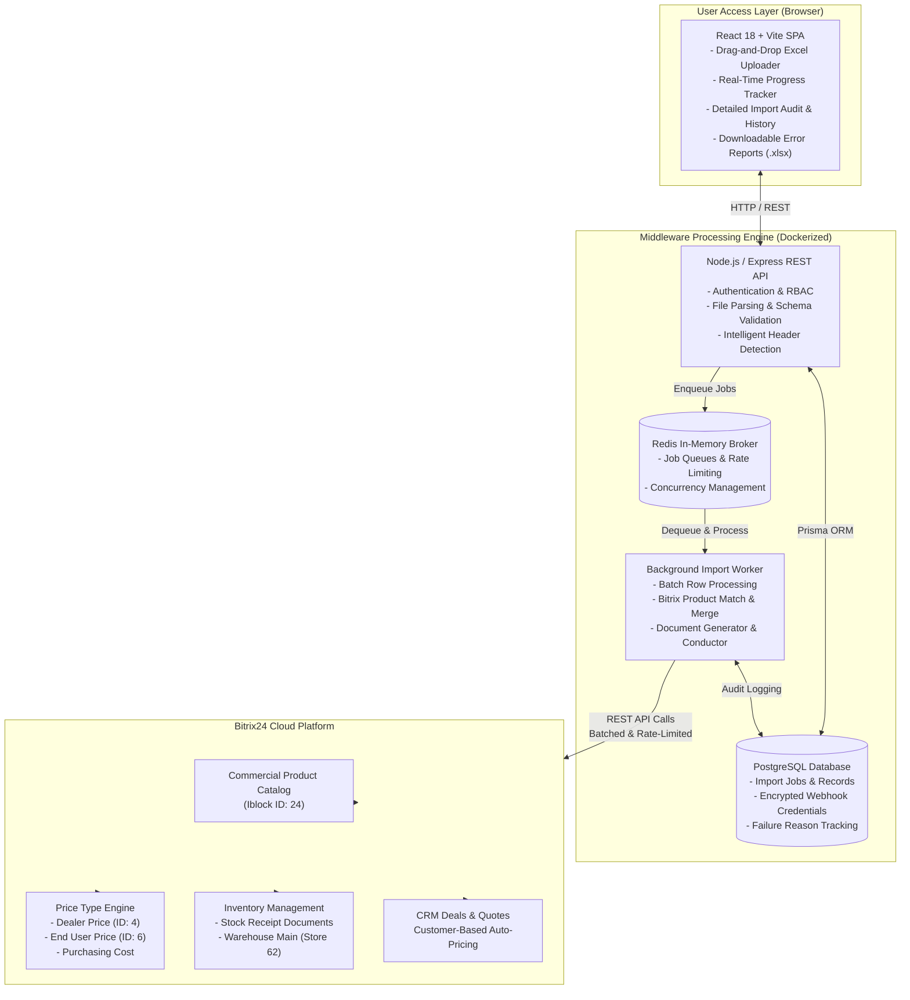
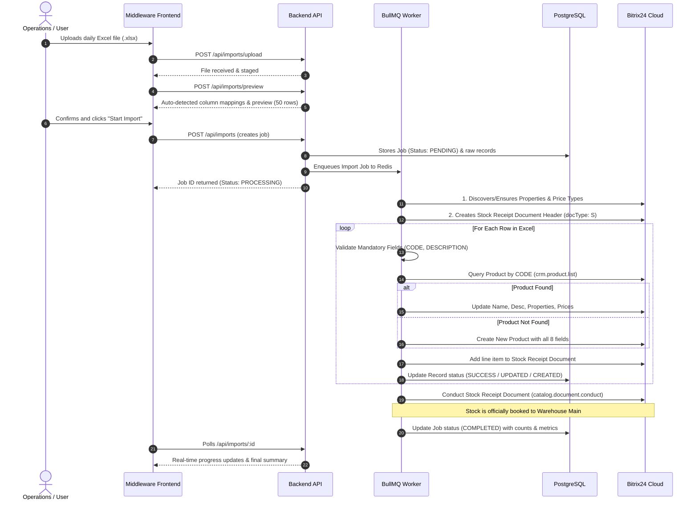

# Bitrix24 Automated Inventory & Catalog Middleware
## System Architecture & Solution Design Document

---

### 1. Executive Summary

The **Bitrix24 Inventory Middleware** is an enterprise-grade automation platform designed to bridge daily supplier/ERP Excel inventory data with **Bitrix24 CRM, Product Catalog, and Inventory Management**.

The solution eliminates manual data entry, prevents product duplication, enforces pricing consistency across customer segments (Dealer vs. End User), and conducts stock receipt documents automatically into Bitrix24 warehouses.

---

### 2. High-Level System Architecture

The middleware is structured into modular layers adhering to enterprise separation of concerns, high throughput, and fault tolerance:

---

### 3. Detailed End-to-End Workflow

---

### 4. Excel Field Alignment & Bitrix24 Mapping Specification

The middleware maps the 8 standard Excel columns into Bitrix24's core architecture so that all 8 fields are prominently visible and accessible across **both the Product Catalog and Inventory Management**:

| # | Excel Column Header | Target Bitrix24 Entity | Bitrix24 Technical Field | Visibility in Inventory Management | Visibility in Product Catalog |
|---|---------------------|------------------------|--------------------------|------------------------------------|-------------------------------|
| **1** | **`CODE`** | Unique Identifier & Display Title | `product.CODE` & `product.NAME` & `PROPERTY_960` | Formatted directly into `Product` column (`[PART NUMBER] \| [CODE] - [DESCRIPTION]`) & visible in Product slider | Dedicated `item code` column & Product details card |
| **2** | **`PART NUMBER`** | Product Title & Catalog Property | `product.NAME` & `PROPERTY_2622` / `PROPERTY_1020` | Formatted directly into `Product` column & visible in Product slider | Dedicated `Part Number` column & Product Title |
| **3** | **`DESCRIPTION`** | Product Description & Display Title | `product.DESCRIPTION` & `detailText` | Formatted directly into `Product` column & visible in Product slider | Dedicated `Detailed description` column |
| **4** | **`QTY IN STOCK`** | Inventory Balance & Document Quantity | `catalog.document.element.amount` & Store 62 Balance | Explicitly displayed in the `Quantity arrived` column & Warehouse Stock Balance | Dedicated `Stock Quantity` column |
| **5** | **`QTY ON ORDER`** | Pipeline Inventory Property | `PROPERTY_2624` (`QTY_ON_ORDER`) | Visible inside the Product slider & Document itemized commentary | Dedicated `Qty on Order` column |
| **6** | **`COST`** | Purchase / Cost Price | `catalog.document.element.purchasingPrice` & `purchasingPrice` | Explicitly displayed in the `Purchase price` column & line item `Total` | Dedicated `Cost` column & purchasing price |
| **7** | **`DEALER PRICE`** | Wholesale Commercial Price Type | `Price Type ID: 4` (`DEALER_PRICE`) & `PROPERTY_2626` | Visible inside the Product slider & Document itemized commentary | Dedicated `Dealer Price` column & Commercial Price Type |
| **8** | **`END USER PRICE`** | Retail Price Type & Base Catalog Price | `Price Type ID: 6` (`END_USER_PRICE`) & `PRICE` | Explicitly displayed in the `Sales price` column, Product slider & commentary | Dedicated `Retail price` & `End User Price` columns |

---

### 5. Core Capabilities & Business Value

#### A. Intelligent Self-Provisioning Schema
* When connected to Bitrix24, the middleware automatically inspects the catalog context.
* If required custom properties (`Part Number`, `Qty on Order`) or price types (`Dealer Price`, `End User Price`) do not exist, the middleware **automatically provisions them via REST API**. No manual setup in Bitrix24 is required.

#### B. Accurate Product Matching & Zero Duplication
* `CODE` serves as the golden product key.
* When re-importing the daily file, existing products are **seamlessly updated** without altering existing Bitrix IDs, CRM deal linkages, or historical sales data.
* New products are automatically created with complete metadata.

#### C. Official Bitrix24 Stock Receipt Conduction
* Unlike shallow scripts that attempt to write raw numbers to database fields, this solution follows Bitrix24's official inventory accounting workflow:
  1. Generates an adjustment / stock receipt document (`catalog.document.add`).
  2. Attaches line items with cost and arrival quantities for each item (`catalog.document.element.add`).
  3. Formally conducts the document (`catalog.document.conduct`, Status: `Y`) to post inventory balances to **Warehouse Main**.

#### D. Streamlined Quotation & Multi-Tier Pricing
* In Bitrix24 CRM (Deals, Quotes, Invoices), sales representatives simply pick products from the catalog.
* Depending on whether the customer is tagged as a **Dealer** or an **End User**, the appropriate price type is applied automatically or chosen from the price dropdown.

#### E. Complete Audit Trail & Error Management
* **Comprehensive Metrics:** Every import run tracks total rows, new products created, existing products updated, successful rows, failed rows, duplicate rows, timestamps, and operating user.
* **Downloadable Error Reports (.xlsx):** If any row fails validation (e.g. missing mandatory description), a formatted Excel sheet is generated specifying the exact row number, CODE, part number, and human-readable error reason.
* **One-Click Retry:** Users can retry failed records directly from the interface.

---

### 6. Technology Stack & Operational Specifications

| Layer | Technology | Purpose |
|---|---|---|
| **Frontend UI** | React 18, TypeScript, TailwindCSS, Vite | Responsive, intuitive single-page web app |
| **Backend API** | Node.js (v20+), Express, TypeScript | REST endpoints, authentication, Excel parsing |
| **Queue & Worker** | BullMQ, Redis 7 (Alpine) | Non-blocking background worker, rate-limit throttling |
| **Database** | PostgreSQL 15, Prisma ORM | Relational persistence, audit history, encrypted credentials |
| **Excel Parser** | ExcelJS, XLSX stream parsing | Memory-efficient streaming of large spreadsheets |
| **Bitrix24 Integration** | Bitrix24 Cloud REST API | Webhook / OAuth integration with SSL/TLS encryption |
| **Deployment** | Docker & Docker Compose | Multi-container reproducible stack |
